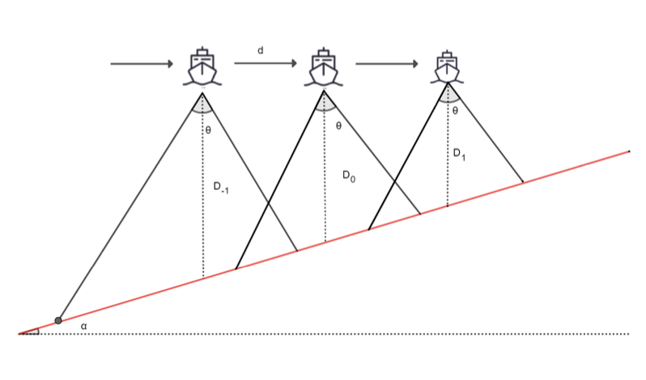
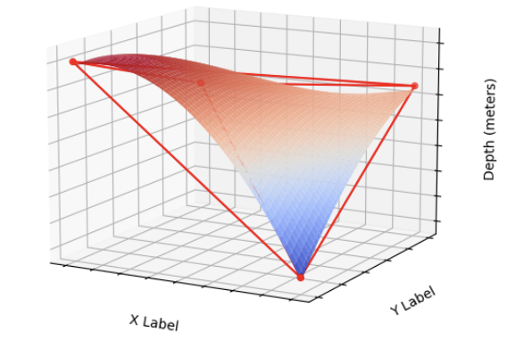

# Twenty Thousand Leagues Under the Sea: Router Planning for Multibeam Bathymetry

## Abstract

Multibeam echo sounding systems overcome the limitations of single-beam systems by simultaneously emitting multiple sound beams and receiving echoes, enabling multi-point measurement and wide coverage of depth data collection. This is crucial for depth measurement and terrain analysis. This project focuses on establishing a multibeam bathymetry model, calculating relevant metrics, and optimizing survey line design.





### Problem 1

- **Task 1:** Develop a model for coverage width and overlap ratio between adjacent strips. Using geometric relationships and related variables, we derive the coverage width model. Given flat seabed slopes and parallel survey lines, we establish the overlap ratio model.
  
- **Task 2:** Calculate the relevant metrics using the established model. With uniform survey line intervals, the depth decreases linearly from 90.9487m to 49.0513m along the survey line direction. The coverage width decreases from 315.8133m to 170.3272m. Starting from the second line, the overlap ratio decreases from 32.8019% to negative values. See the main text or `result1.xlsx` for more data.

### Problem 2

- **Task 1:** Develop a multibeam bathymetry coverage width model along different survey line directions. Analyze potential geometric relationships and summarize the relationship between the angle of intersection of perpendicular planes and seabed slope. Establish the coverage width model for different directions.

- **Task 2:** Use the model to solve for coverage width with given survey line intervals and angles. Maximum coverage width is 770.3323m, and minimum is 63.0514m. With a flat seabed, coverage width is symmetric at given points, remaining constant at 415.6919m when angles are 90° and 270°. See the main text or `result2.xlsx` for more data.

### Problem 3

- Utilize the models from previous problems to prove that maximum coverage width \( W \) is achieved when the survey line direction is parallel to the contour lines (β = 90° or 180°). Literature supports this finding. We propose and prove that a greedy algorithm can achieve the shortest total survey line length when η = 10% and Max(W). The optimization problem of minimizing total line length is divided into sub-problems: termination, distribution, and starting point selection. Iterative simulation via code yields 7 lines with a total length of 25,928 meters.

### Problem 4

- Using differential thinking, subdivide the problem into a 0.02*0.02 nautical mile square area optimization. By dividing the area along its diagonal, we reformulate the problem into one between two slopes. Slopes may tilt, complicating direct slope use. We model positive and negative slopes to restore the problem to a similar situation as Problem 3. An upward slope model increases coverage but not line length optimization, while a downward model optimizes line length but may miss areas. We first optimize the greedy model from Problem 3, then globally seek an optimal solution meeting practical conditions.

## Installation

1. Clone the repository:
    ```bash
    git clone https://github.com/yourusername/optimized-survey-line-planning.git
    ```

2. Navigate to the project directory:
    ```bash
    cd optimized-survey-line-planning
    ```

3. Install required dependencies:
    ```bash
    pip install -r requirements.txt
    ```

## Usage

- Run the main script to perform survey line optimization:
    ```bash
    python main.py
    ```

## Results

- The project provides optimized survey line plans that minimize total length while maximizing coverage, adapting to seabed topography effectively.

## Contributing

- Contributions are welcome! Please submit a pull request or open an issue for any suggestions or bugs.

## License

- This project is licensed under the MIT License.
